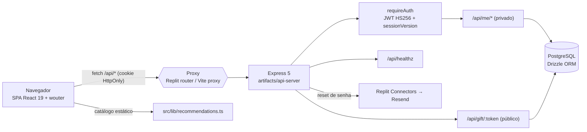

# ARCHITECTURE — Ninho

SPA React (Vite) → API Express montada em `/api` → PostgreSQL (Drizzle).
Sem SSR, sem BFF intermediário: o mesmo host serve o estático e roteia `/api`
para o serviço da API (Replit, `router = "path"`); localmente o proxy do Vite
faz esse papel (`API_PROXY_TARGET`).

## Frontend (`artifacts/ninho`)

- Entrada: `src/main.tsx` → `ErrorBoundary` → `src/App.tsx` (2897 linhas, quase toda a UI).
- Roteamento `wouter` com `base={import.meta.env.BASE_URL}` (`App.tsx:2807`).
  Rotas: `/sign-in`, `/sign-up`, `/forgot-password`, `/reset-password`,
  `/gift/:token` (pública), e as autenticadas `/dashboard`, `/checklist`,
  `/milestones`, `/recommendations`, `/budget`, `/profile`.
- `AppRouter` (`App.tsx:2739`) resolve a sessão (`GET /api/auth/session`, `staleTime: Infinity`)
  antes de decidir entre auth e workspace; a rota `/gift/` é liberada sem sessão.
- `Workspace` (`App.tsx:1638`) é o shell autenticado: escolhe layout desktop
  (`matchMedia("(min-width: 901px)")`) ou o empilhamento de três painéis "Phone"
  no mobile, e concentra **todas** as mutations.
- Cliente HTTP: `src/lib/api.ts` (wrappers tipados à mão sobre `customFetch`,
  `credentials: "include"`); tipos `Server*` duplicam o schema do banco manualmente.

## API (`artifacts/api-server`)

`src/app.ts`: `pino-http` (redige cookie/authorization), `express.json()`,
`trust proxy = "loopback"`, `app.use("/api", router)`. `src/routes/index.ts`
monta `health`, `/auth`, `/me` (todas atrás de `requireAuth`) e `/gift`.

| Método | Rota | Arquivo |
|---|---|---|
| GET | `/api/healthz` | `routes/health.ts` |
| POST | `/api/auth/register`, `/login`, `/logout` | `routes/auth.ts` |
| GET | `/api/auth/session` | `routes/auth.ts:173` |
| POST | `/api/auth/password-reset/request` \| `/complete` | `routes/auth.ts:196,237` |
| GET | `/api/me/workspace` | `routes/me.ts:35` |
| PUT | `/api/me/profile`, `/api/me/budget` | `routes/me.ts:171,358` |
| POST/PATCH/DELETE | `/api/me/checklist[/:id]` | `routes/me.ts:195,239,298` |
| PATCH | `/api/me/milestones/:id` | `routes/me.ts:328` |
| GET/POST/DELETE | `/api/me/share` | `routes/me.ts:65,75,106` |
| PATCH/DELETE | `/api/me/gift-reservations/:id` | `routes/me.ts:129,152` |
| GET | `/api/gift/:token` | `routes/gift.ts:54` |
| POST | `/api/gift/:token/reservations` | `routes/gift.ts:101` |

## Autenticação

Senha com `scrypt` (N=32768, r=8, p=1, salt 16B, `scrypt$salt$hash`) e comparação
`timingSafeEqual` (`lib/auth.ts:181-213`). Sessão é um JWT HS256 **assinado à mão**
(`createSessionToken`, `lib/auth.ts:215`) com `sub`, `sv` (sessionVersion), `exp`
(7 dias), entregue no cookie `ninho_session` (`HttpOnly; SameSite=Lax; Path=/`,
`Secure` só em produção). `requireAuth` (`middlewares/requireAuth.ts`) valida a
assinatura e compara `sv` com `auth_users.session_version` — incrementar essa
coluna invalida todas as sessões (usado no reset de senha). Login, registro e
(desde a Fase 0) o pedido de reset passam por limitadores em memória por
IP e por conta (`AuthAttemptLimiter`, `lib/auth.ts:42`).

## Endpoint único de workspace

`GET /api/me/workspace` chama `initializeUser()` (`lib/seed.ts`) — que cria o
profile com `INSERT ... ON CONFLICT DO NOTHING` e, **só** para perfis novos, semeia
checklist/marcos/orçamento na mesma transação — e devolve
`{ profile, items, milestones, budget, giftReservations }` em uma chamada.

## Estado no cliente

React Query com chaves `["workspace", userId]`, `["gift-share", userId]`,
`["auth-session"]`, `["public-gift-list", token]` (esta com `refetchInterval: 15s`).
Checklist e marcos usam atualização otimista (`onMutate` → `cancelQueries` →
snapshot → `setQueryData`; rollback em `onError`; `onSettled` invalida o workspace
inteiro). Perfil, orçamento, share e reservas escrevem direto no cache em `onSuccess`.

## Catálogo de recomendações

`artifacts/ninho/src/lib/recommendations.ts` — catálogo **estático no frontend**
(8 itens, links de busca da Amazon), com janela de validade (`reviewedAt`/`expiresAt`),
`visibility` e verificação de URL https. `getNextRecommendationRefreshDelay()`
alimenta um `setTimeout` que reavalia a vitrine na virada da expiração
(`useRecommendationClock`, `App.tsx:150`). Os mesmos IDs estão duplicados no backend
em `lib/db/src/schema/checklistItems.ts` (`RECOMMENDATION_IDS`,
`RECOMMENDATION_CATEGORY_BY_ID`) para validar o vínculo item↔recomendação.

## Lista de presentes pública

O dono gera um token (`POST /api/me/share`, 32 bytes base64url, um link ativo por
usuário garantido por advisory lock + índice único parcial). Visitantes abrem
`/gift/:token` e só recebem `ownerName`, `babyName` e itens com status "A comprar"
(`publicItem()` em `routes/gift.ts:31` — sem preço, orçamento ou dados pessoais).
A reserva é anônima, serializada por `SELECT ... FOR UPDATE` e protegida por índice
único em `checklist_item_id` (conflito → HTTP 409).

## Contrato/codegen

`lib/api-spec/openapi.yaml` descreve **apenas** `/healthz`; Orval gera
`lib/api-client-react` e `lib/api-zod`. Do gerado, o app usa só `customFetch`;
o restante do contrato é mantido à mão em `src/lib/api.ts` (ver CONCERNS).
